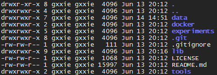

# Linux文件

## Linux文件属性

各字段意义：

[权限] \[链接] \[拥有者] \[群组] \[文件大小] \[修改日期] \[文件名]

### 文件权限

由十个字符组成：

- 第一个字符：

  当为[ d ]则是目录  

  当为[ - ]则是文件  

  若是[ l ]则表示为链接文件（link file）  

  若是[ b ]则表示为设备文件里面的可供储存的周边设备（可随机存取设备）  

  若是[ c ]则表示为设备文件里面的序列埠设备，例如键盘、鼠标（一次性读取设 备） 。  

- 字符2-4：文件拥有者权限。

  - r：可读取此一文件的实际内容，如读取文本文件的文字内容等；    
  - w：可以编辑、新增或者是修改该文件的内容（但不含删除该文件） ；    
  - x：该文件具有可以被系统执行的权限。    
  - -：没有权限

- 字符5-7： 群组权限

- 字符8-10：其他人权限

- 对目录来说，rwx分别具有以下意义：

  - r:表示具有读取目录结构清单的权限，所以当你具有读取（r） 一个目录的权限时，表示你 可以查询该目录下的文件名数据。    
  - w:创建新的文件与目录； 删除已经存在的文件与目录（不论该文件的权限为何！） 将已存在的文件或目录进行更名； 搬移该目录内的文件、目录位置。    
  - x: 目录的x代表的是使用者能否进入该目录成为工作目录的用途！    

### 改变文件权限
- 改变用户组：chgrp
  chgrp [-R] groupname filename/dirname
  \-R: 递归改变文件夹下所有文件所属组信息

- 改变拥有者：chown
  chown [-R] username filename/dirname

- 改变权限：chmod
  chmod [-R] xyz filename/firname
  xyz：权限，例777->rwxrwxrwx
> Tips
basename:取得文件名  
dirname：取得目录名  
cat： 由第一行开始显示文件内容  
tac： 从最后一行开始显示，可以看出 tac 是 cat 的倒着写！  
nl：显示的时候，顺道输出行号！  
more： 一页一页的显示文件内容  
less： 与 more 类似，但是比 more 更好的是，他可以往前翻页！  
head： 只看头几行  
tail： 只看尾巴几行  
od： 以二进制的方式读取文件内容！  

### 文件搜寻
whereis [-bmsu] filename/dirname  
在特定的目录下搜寻文件名
locate  
find  

  